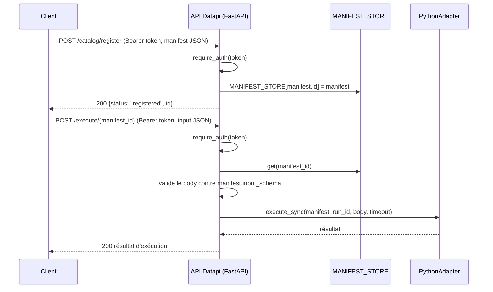

# General

Provide an API for algorithm registered in [regles.data.gouv.fr](www.regles.data.gouv.fr)

This repository contains a POC scaffold for a centralized algorithm catalog and execution API (FastAPI + RQ). See `docker-compose.yaml` to run a local stack and `examples/python` for a sample algorithm and manifest.

Algorithms are run through per-language adapters (`adapters/`), selected from a manifest's `runtime.language`. Besides plain Python (`adapters/python_adapter.py`), there's an adapter for [Catala](https://catala-lang.org/) (`adapters/catala_adapter.py`), a DSL for turning legal/regulatory text into faithful, auditable code — the approach used in production by [Prest'Agri](https://github.com/betagouv/prestagri). See `examples/catala/` for a worked example and how it was compiled.

Pour intégrer votre propre algorithme (Python ou Catala) dans le catalogue, voir le guide [`docs/INTEGRATION.md`](docs/INTEGRATION.md).

Tests unitaires (`tests/`, adapters + catalogue, sans serveur HTTP) :

```sh
uv run pytest
```

## Appeler une API enregistrée

Toutes les routes du catalogue exigent un header `Authorization: Bearer <AUTH_TOKEN>` (voir `require_auth` dans `api/server.py`). Séquence typique : enregistrement d'un manifeste, puis exécution de l'algorithme qu'il décrit.



Exemple avec `requests` (voir `scripts/smoke_test.py`) :

```python
headers = {"Authorization": f"Bearer {AUTH_TOKEN}"}

# 1. Enregistrer le manifeste
requests.post("http://127.0.0.1:8000/catalog/register", json=manifest, headers=headers)

# 2. Exécuter l'algorithme enregistré
requests.post(f"http://127.0.0.1:8000/execute/{manifest['id']}", json=input_data, headers=headers)
```
# datapi
