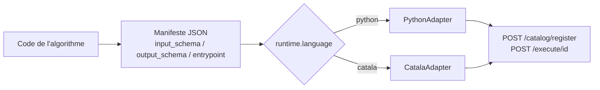

# Guide d'intégration — enregistrer un algorithme Python ou Catala

Ce guide s'adresse à une équipe qui possède déjà un algorithme (Python natif,
ou Catala compilé) et veut l'exposer via Datapi. Il complète le
[README](../README.md) (auth, séquence register/execute) en détaillant ce qui
est spécifique à chaque langage.

Dans les deux cas, l'intégration suit la même mécanique : décrire
l'algorithme dans un **manifeste JSON** conforme à
[`catalog/manifest.schema.json`](../catalog/manifest.schema.json), puis
l'enregistrer et l'exécuter via l'API. Ce qui change entre Python et Catala,
c'est uniquement `runtime.language` et `entrypoint`, qui déterminent quel
adapter (`adapters/`) prend la main.



## Le manifeste, commun aux deux langages

Champs requis (voir le schéma complet) :

| Champ | Rôle |
|---|---|
| `id` | Identifiant unique dans le catalogue, utilisé dans l'URL `/execute/{id}` |
| `name`, `description`, `org` | Métadonnées d'affichage |
| `runtime.language` | `"python"` ou `"catala"` — sélectionne l'adapter (`api/server.py`, dict `ADAPTERS`) |
| `entrypoint.type` / `entrypoint.target` | Comment charger et appeler le code (détails ci-dessous par langage) |
| `input_schema` / `output_schema` | JSON Schema. `input_schema` est validé par l'API (`api/server.py`) **et** par l'adapter avant chaque exécution |
| `resources.timeout_seconds` | Timeout d'exécution passé à l'adapter |
| `source` | Chemin(s) vers le(s) fichier(s) source, pour traçabilité |
| `sample_inputs` | Un exemple d'entrée valide, utile pour tester rapidement |

Les deux exemples fournis (`examples/python/manifest.json` et
`examples/catala/manifest.json`) calculent le même « quotient familial » et
peuvent servir de gabarit à copier.

## Intégrer un algorithme Python

Adapter : [`adapters/python_adapter.py`](../adapters/python_adapter.py).

### 1. Écrire le code

Deux formes sont acceptées, choisies par `entrypoint.type` :

- **`python:class`** — une classe avec une méthode `run(self, data: dict) -> dict`.
- **`python:function`** — une fonction `f(data: dict) -> dict`.

Dans les deux cas, `data` est le body JSON déjà validé contre `input_schema`,
et la valeur de retour doit être un `dict` sérialisable en JSON, conforme à
`output_schema`.

```python
# examples/python/sample_algorithm.py
class SampleQuotientFamilial:
    def run(self, data):
        agent = data.get("agent_revenu", 0) or 0
        conj = data.get("conjoint_revenu") or 0
        children = data.get("agent_enfants", 0) or 0
        denom = max(1, children + 1)
        value = (agent + conj) / denom
        return {"value": f"{value:.2f}€", "explanation": f"Computed ({agent}+{conj})/{denom}"}
```

Le module doit être importable par le process de l'API (installé, ou sur le
`PYTHONPATH` — c'est le cas pour tout ce qui vit sous le paquet du dépôt,
comme `examples/python/`).

### 2. Écrire le manifeste

```json
{
  "id": "monorg.mon_algo",
  "name": "Mon algorithme",
  "org": "monorg",
  "runtime": { "language": "python", "version": "3.11", "primary": true },
  "entrypoint": { "type": "python:class", "target": "monorg.mon_algo:MonAlgo" },
  "input_schema": { "type": "object", "required": ["x"], "properties": { "x": { "type": "number" } } },
  "output_schema": { "type": "object", "required": ["y"], "properties": { "y": { "type": "number" } } },
  "resources": { "timeout_seconds": 10 },
  "sample_inputs": { "x": 1 }
}
```

`entrypoint.target` suit toujours la forme `module.path:attribut` — c'est
`adapters/python_adapter.py`'s `_load_callable` qui fait
`importlib.import_module(module_path)` puis `getattr(mod, attr)`.

### 3. Tester en local, sans passer par l'API

```python
from adapters.python_adapter import PythonAdapter
import json

manifest = json.load(open("monorg/mon_algo.manifest.json"))
print(PythonAdapter().execute_sync(manifest, "run1", {"x": 1}, exec_opts={"timeout_seconds": 10}))
```

Ça exécute exactement le même chemin de code que l'API (`validate_input` puis
appel de l'entrypoint), donc les erreurs de schéma ou d'import se voient
avant même de lancer le serveur.

## Intégrer un algorithme Catala

Adapter : [`adapters/catala_adapter.py`](../adapters/catala_adapter.py).
Exemple complet et commenté : [`examples/catala/`](../examples/catala/) —
mêmes calculs que l'exemple Python, pour comparaison directe.

### Principe : compilation à froid, l'adapter ne fait qu'importer

[Catala](https://catala-lang.org/) est un DSL pour transcrire fidèlement un
texte légal/réglementaire en code exécutable et auditable (approche utilisée
en production par [Prest'Agri](https://github.com/betagouv/prestagri)).
Datapi ne compile **jamais** de Catala à la volée : la compilation
(`catala python` ou `clerk build`, voir le
[guide Catala](https://book.catala-lang.org/en/1-0-getting_started.html)) est
une étape de build, réalisée en amont et dont le résultat (le module Python
généré) est ce qui est déployé / commité. `CatalaAdapter` se contente
d'importer ce module déjà compilé et d'appeler la fonction de scope, comme
`PythonAdapter` le fait pour du Python écrit à la main.

```
src/mon_algo.catala_fr   --catala/clerk-->   generated/MonAlgo.py   --importé par-->   CatalaAdapter
   (source de vérité)         (build-time)      (déployé/commité)         (run-time)
```

### 1. Compiler

En s'inspirant de [`examples/catala/`](../examples/catala/) : un
`clerk.toml` pour le build, une source `.catala_fr`/`.catala_en`, et une
sortie `generated/` qui n'a pas de dépendance pip au-delà de la stdlib.

### 2. Manifeste

```json
{
  "id": "monorg.mon_algo_catala",
  "name": "Mon algorithme (Catala)",
  "org": "monorg",
  "runtime": { "language": "catala", "version": "dev", "primary": true },
  "entrypoint": { "type": "catala:scope", "target": "monorg.generated.MonAlgo:mon_scope" },
  "input_schema": { "...": "..." },
  "output_schema": { "...": "..." },
  "source": ["monorg/src/mon_algo.catala_fr"]
}
```

- `runtime.language` doit être `"catala"`.
- `entrypoint.type` doit être `"catala:scope"`.
- `entrypoint.target` = `module:fonction_de_scope`, où `fonction_de_scope`
  est la fonction générée pour le scope Catala (ex. `quotient_familial`),
  qui prend une seule struct d'entrée en paramètre.

### 3. Marshalling JSON ↔ Catala

`CatalaAdapter` convertit automatiquement, sans mapping manuel, en
s'appuyant sur les annotations de type de la struct d'entrée générée
(`typing.get_type_hints`) :

- types primitifs : `Money`, `Integer`, `Decimal`, `Bool`, `Date` (`"YYYY-MM-DD"`) ;
- `Option[T]` (valeur ou `null`) et `Array[T]` (liste JSON) ;
- structs imbriquées (`CatalaStruct`), champ par champ.

Note : les champs de struct d'entrée générés par Catala portent souvent un
suffixe `_in` (ex. `agent_revenu_in`) ; l'adapter accepte la clé JSON avec ou
sans ce suffixe, donc `input_schema` peut rester dans le vocabulaire métier
sans le suffixe.

Ce qui **n'est pas** géré automatiquement : les types que le compilateur
Catala marque « externes » (ex. payloads de `CatalaEnum`). Pour ceux-là,
écrire un petit wrapper Python autour de l'appel au scope généré (comme le
font `aides.py`/`utils.py` de Prest'Agri) et l'enregistrer comme un
algorithme **Python** classique (`entrypoint.type: "python:class"` ou
`"python:function"`) qui appelle le module Catala en interne. Les deux
adapters se composent ainsi au lieu de dupliquer la logique de marshalling.

### 4. Tester en local

```sh
python3 -c "
from adapters.catala_adapter import CatalaAdapter
import json
manifest = json.load(open('monorg/mon_algo_catala.manifest.json'))
print(CatalaAdapter().execute_sync(manifest, 'run1', {'x': 1}, exec_opts={'timeout_seconds': 10}))
"
```

Une erreur métier levée par le scope Catala lui-même (ex. `NoValue`,
`DivisionByZero`, `AssertionFailed` — sous-classes de `CatalaError`) est
remontée comme `{"status": "failed", ...}`, distinct de `{"status": "error",
...}` réservé aux erreurs d'adapter/infra.

## Enregistrer et exécuter (commun aux deux langages)

Une fois le manifeste écrit et testé en local via l'adapter, l'enregistrement
et l'exécution passent par l'API HTTP, avec un header
`Authorization: Bearer <AUTH_TOKEN>` (voir `require_auth` dans
`api/server.py`) — voir la séquence détaillée dans le
[README](../README.md#appeler-une-api-enregistrée).

```python
import requests, json

headers = {"Authorization": f"Bearer {AUTH_TOKEN}"}
manifest = json.load(open("monorg/mon_algo.manifest.json"))

requests.post("http://127.0.0.1:8000/catalog/register", json=manifest, headers=headers)
requests.post(f"http://127.0.0.1:8000/execute/{manifest['id']}", json={"x": 1}, headers=headers)
```

## Checklist avant d'enregistrer un algorithme

- [ ] `id` unique, `runtime.language` correct (`python` ou `catala`).
- [ ] `entrypoint.target` pointe vers un module **importable** par le process API.
- [ ] `input_schema` / `output_schema` couvrent bien les champs réellement utilisés.
- [ ] Exécution en local via l'adapter (`execute_sync`) validée avec `sample_inputs`, avant tout appel HTTP.
- [ ] Pour Catala : le module `generated/` est bien commité/déployé (pas de compilation à la volée attendue).
- [ ] Pour Catala : tout type « externe » (enum à payload, etc.) a son wrapper Python dédié plutôt qu'un marshalling générique supposé.
