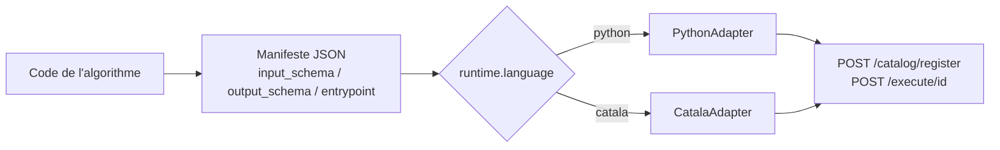

# Guide d'intégration — enregistrer un algorithme Python ou Catala

Ce guide s'adresse à une équipe qui possède déjà un algorithme (Python natif,
ou Catala compilé) et veut l'exposer via Datapi. Il complète le
[README](../README.md) (auth, séquence register/execute) en détaillant ce qui
est spécifique à chaque langage.

Dans les deux cas, l'intégration suit la même mécanique : décrire
l'algorithme dans un **manifeste JSON** conforme à
[`catalog/manifest.schema.json`](../catalog/manifest.schema.json), puis
l'enregistrer et l'exécuter via l'API. Ce qui change entre Python et Catala,
c'est uniquement `runtime.language` et `entrypoint`, qui déterminent quel
adapter (`adapters/`) prend la main.



## Le manifeste, commun aux deux langages

Champs requis (voir le schéma complet) :

| Champ | Rôle |
|---|---|
| `id` | Identifiant unique dans le catalogue, utilisé dans l'URL `/execute/{id}` |
| `name`, `description`, `org` | Métadonnées d'affichage |
| `runtime.language` | `"python"` ou `"catala"` — sélectionne l'adapter (`api/server.py`, dict `ADAPTERS`) |
| `entrypoint.type` / `entrypoint.target` | Comment charger et appeler le code (détails ci-dessous par langage) |
| `input_schema` / `output_schema` | JSON Schema. `input_schema` est validé par l'API (`api/server.py`) **et** par l'adapter avant chaque exécution |
| `resources.timeout_seconds` | Timeout d'exécution passé à l'adapter |
| `source` | Chemin(s) vers le(s) fichier(s) source, pour traçabilité |
| `sample_inputs` | Un exemple d'entrée valide, utile pour tester rapidement |

Les deux exemples fournis (`examples/python/manifest.json` et
`examples/catala/manifest.json`) calculent le même « quotient familial » et
peuvent servir de gabarit à copier.

## Un dépôt qui expose plusieurs algorithmes : le manifeste « paquet »

Un dépôt (typiquement une administration) peut exposer plusieurs services
sous un même paquet de code — c'est le cas de
[Prest'Agri](https://github.com/betagouv/prestagri), qui calcule à la fois
une aide à la scolarité et un quotient familial. Plutôt que d'écrire un
`manifest.json` par service, `catalog/manifest.schema.json` accepte aussi une
forme **paquet** : champs partagés au niveau racine (`org`, `license`,
`tags`, `dct:source`) + un tableau `algorithms`, chaque entrée ayant sa
propre `id`/`entrypoint`/`input_schema`/`output_schema`, exactement comme un
manifeste à un seul algorithme.

```json
{
  "org": "betagouv.prestagri",
  "license": "MIT",
  "dct:source": {
    "schema:codeRepository": "https://github.com/betagouv/prestagri",
    "schema:programmingLanguage": ["Python", "Catala"],
    "schema:softwareVersion": "0.1.0"
  },
  "algorithms": [
    { "id": "prestagri.aide_scolarite", "dct:identifier": "prestagri-aide-scolarite", "...": "..." },
    { "id": "prestagri.quotient_familial", "dct:identifier": "prestagri-quotient-familial", "...": "..." }
  ]
}
```

La forme à un seul algorithme (sans `algorithms`, comme
`examples/python/manifest.json`) reste valide — pas de migration forcée,
c'est le cas le plus simple à préférer tant qu'un dépôt n'expose qu'un seul
service.

- `catalog.manifest_loader.load_manifests(path)` charge un fichier des deux
  formes et retourne toujours une liste d'entrées aplaties (fusion des
  champs partagés dans chaque entrée — l'entrée l'emporte si elle définit
  déjà le champ). `load_manifest(path)` (forme à un algorithme) lève une
  erreur explicite si le fichier est en forme paquet.
- `POST /catalog/register` détecte la forme paquet (`"algorithms" in
  manifest`) et enregistre chaque entrée aplatie séparément ; la réponse
  devient `{"status": "registered", "ids": [...]}` (au lieu d'un `id` seul).
  L'exécution (`POST /execute/{id}`) est inchangée : chaque algorithme du
  paquet est ensuite un manifeste normal dans le catalogue.

### Vocabulaire CPSV-AP natif

Trois champs optionnels, au niveau algorithme, reprennent directement les
clés du [CPSV-AP](https://semiceu.github.io/CPSV-AP/releases/2.2.1/) utilisé
par le catalogue national
[regles.data.gouv.fr](https://github.com/datagouv/regles.data.gouv.fr)
plutôt que d'inventer un vocabulaire Datapi à faire correspondre ensuite :

| Champ | Rôle |
|---|---|
| `dct:identifier` | Identifiant du service au sens CPSV-AP (peut différer de `id`, qui est l'identifiant technique Datapi) |
| `cv:hasChannel` | `{ "foaf:page": "...", "dct:description": "..." }` — le point d'accès (API) du service |
| `dct:source` | Provenance : au niveau algorithme, un tableau `[{ "id": "<url>" }, ...]` de liens vers le code exact ; au niveau paquet, un objet unique (`schema:codeRepository`/`schema:programmingLanguage`/`schema:softwareVersion`) — même clé, forme différente selon le niveau, qui reproduit le nœud agrégateur du vrai `metadata.jsonld` (l'agrégateur référence un unique `schema:SoftwareSourceCode`, chaque service référence des lignes de code précises) |

`name`/`description` ne sont pas renommés en `dct:title`/`dct:description` :
ils existent déjà, sont utilisés ailleurs dans le repo (fallback
pyproject.toml, docs, console admin) et correspondent sans ambiguïté à ces
deux prédicats CPSV-AP.

Convention pour `input_schema`/`output_schema` : `title`/`description` sont
déjà des mots-clés JSON Schema natifs — les poser directement sur chaque
propriété plutôt que dans une structure séparée ; c'est ce que
`manifest_to_jsonld` (ci-dessous) lit pour peupler `cv:hasInput`/
`cpsv:produces`.

### Migrer une entrée regles.data.gouv.fr existante

Si un service est déjà décrit par un `metadata.jsonld` CPSV-AP écrit à la
main, `catalog.jsonld_converter.import_jsonld_into_manifest(manifest,
jsonld_text)` gap-fill (jamais d'écrasement d'un champ déjà présent) les
champs ci-dessus dans le manifeste Datapi, et retourne aussi une liste
d'avertissements :

```python
from catalog.jsonld_converter import import_jsonld_into_manifest
import json

manifest = json.load(open("mon_org/manifest.json"))
jsonld_text = open("mon_org/metadata.jsonld").read()  # récupéré depuis regles.data.gouv.fr, pas committé

manifest, warnings = import_jsonld_into_manifest(manifest, jsonld_text)
for w in warnings:
    print("A traiter à la main:", w)

json.dump(manifest, open("mon_org/manifest.json", "w"), indent=2, ensure_ascii=False)
```

C'est ce script, appliqué une fois au `metadata.jsonld` réel de Prest'Agri
(2 services : `quotient-familial` et `aide-scolarite`), qui a produit la
forme paquet de `examples/prestagri/manifest.json` — le `metadata.jsonld`
d'origine n'est pas committé à côté (usage ponctuel), il vit comme fixture
de test dans `tests/test_jsonld_converter.py`. Le service quotient-familial,
n'ayant pas encore d'entrée `algorithms[]` correspondante, est ressorti dans
`warnings` plutôt qu'ajouté avec un `entrypoint` inventé.

- Chaque entrée `algorithms[i]` est appariée au service `cpsv:PublicService`
  du `metadata.jsonld` dont le `dct:identifier` correspond ; si l'entrée n'a
  pas encore de `dct:identifier` et qu'il ne reste qu'un seul service non
  apparié, l'appariement se fait automatiquement. Dans tout autre cas
  ambigu, une `ValueError` explicite est levée plutôt que de deviner.
- Un service du `metadata.jsonld` qui ne correspond à aucune entrée
  existante n'est **pas** ajouté automatiquement (pas d'`entrypoint`
  inventable) : il remonte dans `warnings`, à ajouter à la main si ce
  service doit devenir un algorithme Datapi séparé.
- La marche est récursive dans `input_schema`/`output_schema` (à toute
  profondeur) : chaque propriété dont le nom correspond à un `dct:identifier`
  de `cv:hasInput`/`cpsv:produces` reçoit son `title`/`description`.

### Publier vers regles.data.gouv.fr

`catalog.jsonld_converter.manifest_to_jsonld(manifest)` fait l'inverse pour
les champs modélisés : il génère un `metadata.jsonld` CPSV-AP à partir d'un
manifeste (forme à un algorithme ou paquet), en dérivant `cv:hasInput`/
`cpsv:produces` par aplatissement de `input_schema`/`output_schema`. Exposé
via l'API pour un algorithme déjà enregistré :

```sh
curl -H "Authorization: Bearer $AUTH_TOKEN" \
  http://127.0.0.1:8000/catalog/prestagri.aide_scolarite/metadata.jsonld
```

Cette route génère le `metadata.jsonld` du seul service demandé, à partir de
l'entrée déjà aplatie dans le catalogue — reconstruire le regroupement
multi-services d'origine (nœud agrégateur `dct:hasPart`) à l'export est une
amélioration future, hors périmètre pour l'instant.

Limite à connaître : l'aplatissement de `cv:hasInput`/`cpsv:produces` est
keyé par nom de propriété, pas par chemin (comme l'import, à toute
profondeur) — si `input_schema`/`output_schema` réutilise le même nom de
propriété dans deux branches différentes (ex. `revenu_fiscal_reference` dans
deux tableaux imbriqués distincts), le `metadata.jsonld` généré aura une
entrée dupliquée par occurrence plutôt qu'une seule entrée dédupliquée.

## Intégrer un algorithme Python

Adapter : [`adapters/python_adapter.py`](../adapters/python_adapter.py).

### 1. Écrire le code

Deux formes sont acceptées, choisies par `entrypoint.type` :

- **`python:class`** — une classe avec une méthode `run(self, data: dict) -> dict`.
- **`python:function`** — une fonction `f(data: dict) -> dict`.

Dans les deux cas, `data` est le body JSON déjà validé contre `input_schema`,
et la valeur de retour doit être un `dict` sérialisable en JSON, conforme à
`output_schema`.

```python
# examples/python/sample_algorithm.py
class SampleQuotientFamilial:
    def run(self, data):
        agent = data.get("agent_revenu", 0) or 0
        conj = data.get("conjoint_revenu") or 0
        children = data.get("agent_enfants", 0) or 0
        denom = max(1, children + 1)
        value = (agent + conj) / denom
        return {"value": f"{value:.2f}€", "explanation": f"Computed ({agent}+{conj})/{denom}"}
```

Le module doit être importable par le process de l'API (installé, ou sur le
`PYTHONPATH` — c'est le cas pour tout ce qui vit sous le paquet du dépôt,
comme `examples/python/`).

### 2. Écrire le manifeste

```json
{
  "id": "monorg.mon_algo",
  "name": "Mon algorithme",
  "org": "monorg",
  "runtime": { "language": "python", "version": "3.11", "primary": true },
  "entrypoint": { "type": "python:class", "target": "monorg.mon_algo:MonAlgo" },
  "input_schema": { "type": "object", "required": ["x"], "properties": { "x": { "type": "number" } } },
  "output_schema": { "type": "object", "required": ["y"], "properties": { "y": { "type": "number" } } },
  "resources": { "timeout_seconds": 10 },
  "sample_inputs": { "x": 1 }
}
```

`entrypoint.target` suit toujours la forme `module.path:attribut` — c'est
`adapters/python_adapter.py`'s `_load_callable` qui fait
`importlib.import_module(module_path)` puis `getattr(mod, attr)`.

### 1bis. Intégrer un paquet conforme à [regalgo](https://github.com/datagouv/regalgo)

Si l'algorithme existe déjà sous forme d'un paquet Python conforme à la
convention `regalgo` (une classe exposant `algo_id`, `regulation` et
`compute(algo_input: regalgo.AlgoInput) -> regalgo.AlgoResult`), pas besoin
d'écrire un wrapper `run(data) -> dict` par paquet : `entrypoint.type:
"python:regalgo_class"` fait le pont de façon générique, pour n'importe quel
paquet de ce type, dans `adapters/python_adapter.py`.

```json
{
  "entrypoint": { "type": "python:regalgo_class", "target": "monorg.mon_algo.regles:MonAlgo" },
  "input_schema": {
    "type": "object",
    "required": ["data", "context"],
    "properties": {
      "data": { "type": "object" },
      "context": { "type": "object" }
    }
  },
  "output_schema": {
    "type": "object",
    "required": ["value", "algo_id", "regulation", "inputs_snapshot", "metadata"]
  }
}
```

- Le body JSON envoyé à `/execute/{id}` doit avoir la forme
  `{"data": {...}, "context": {...}}` — c'est directement la structure de
  `regalgo.AlgoInput`, reconstruite telle quelle avant l'appel à `compute()`.
- La sortie est `regalgo.AlgoResult` sérialisé tel quel (`value`, `algo_id`,
  `regulation`, `inputs_snapshot`, `metadata`), avec les types non
  JSON-natifs (`Decimal`, `date`/`datetime`) convertis en chaînes.
- Voir [`examples/pass-culture-package/manifest.json`](../examples/pass-culture-package/manifest.json)
  pour un exemple complet — `entrypoint.target` y pointe directement sur
  `pass_culture_rules.montant_total.regles:MontantTotalAlgo`, sans aucun
  code de glue spécifique à ce paquet.

### 3. Tester en local, sans passer par l'API

```python
from adapters.python_adapter import PythonAdapter
import json

manifest = json.load(open("monorg/mon_algo.manifest.json"))
print(PythonAdapter().execute_sync(manifest, "run1", {"x": 1}, exec_opts={"timeout_seconds": 10}))
```

Ça exécute exactement le même chemin de code que l'API (`validate_input` puis
appel de l'entrypoint), donc les erreurs de schéma ou d'import se voient
avant même de lancer le serveur.

## Intégrer un algorithme Catala

Adapter : [`adapters/catala_adapter.py`](../adapters/catala_adapter.py).
Exemple complet et commenté : [`examples/catala/`](../examples/catala/) —
mêmes calculs que l'exemple Python, pour comparaison directe.

### Principe : compilation à froid, l'adapter ne fait qu'importer

[Catala](https://catala-lang.org/) est un DSL pour transcrire fidèlement un
texte légal/réglementaire en code exécutable et auditable (approche utilisée
en production par [Prest'Agri](https://github.com/betagouv/prestagri)).
Datapi ne compile **jamais** de Catala à la volée : la compilation
(`catala python` ou `clerk build`, voir le
[guide Catala](https://book.catala-lang.org/en/1-0-getting_started.html)) est
une étape de build, réalisée en amont et dont le résultat (le module Python
généré) est ce qui est déployé / commité. `CatalaAdapter` se contente
d'importer ce module déjà compilé et d'appeler la fonction de scope, comme
`PythonAdapter` le fait pour du Python écrit à la main.

```
src/mon_algo.catala_fr   --catala/clerk-->   generated/MonAlgo.py   --importé par-->   CatalaAdapter
   (source de vérité)         (build-time)      (déployé/commité)         (run-time)
```

### 1. Compiler

En s'inspirant de [`examples/catala/`](../examples/catala/) : un
`clerk.toml` pour le build, une source `.catala_fr`/`.catala_en`, et une
sortie `generated/` qui n'a pas de dépendance pip au-delà de la stdlib.

### 2. Manifeste

```json
{
  "id": "monorg.mon_algo_catala",
  "name": "Mon algorithme (Catala)",
  "org": "monorg",
  "runtime": { "language": "catala", "version": "dev", "primary": true },
  "entrypoint": { "type": "catala:scope", "target": "monorg.generated.MonAlgo:mon_scope" },
  "input_schema": { "...": "..." },
  "output_schema": { "...": "..." },
  "source": ["monorg/src/mon_algo.catala_fr"]
}
```

- `runtime.language` doit être `"catala"`.
- `entrypoint.type` doit être `"catala:scope"`.
- `entrypoint.target` = `module:fonction_de_scope`, où `fonction_de_scope`
  est la fonction générée pour le scope Catala (ex. `quotient_familial`),
  qui prend une seule struct d'entrée en paramètre.

### 3. Marshalling JSON ↔ Catala

`CatalaAdapter` convertit automatiquement, sans mapping manuel, en
s'appuyant sur les annotations de type de la struct d'entrée générée
(`typing.get_type_hints`) :

- types primitifs : `Money`, `Integer`, `Decimal`, `Bool`, `Date` (`"YYYY-MM-DD"`) ;
- `Option[T]` (valeur ou `null`) et `Array[T]` (liste JSON) ;
- structs imbriquées (`CatalaStruct`), champ par champ.

Note : les champs de struct d'entrée générés par Catala portent souvent un
suffixe `_in` (ex. `agent_revenu_in`) ; l'adapter accepte la clé JSON avec ou
sans ce suffixe, donc `input_schema` peut rester dans le vocabulaire métier
sans le suffixe.

Ce qui **n'est pas** géré automatiquement : les types que le compilateur
Catala marque « externes » (ex. payloads de `CatalaEnum`). Pour ceux-là,
écrire un petit wrapper Python autour de l'appel au scope généré (comme le
font `aides.py`/`utils.py` de Prest'Agri) et l'enregistrer comme un
algorithme **Python** classique (`entrypoint.type: "python:class"` ou
`"python:function"`) qui appelle le module Catala en interne. Les deux
adapters se composent ainsi au lieu de dupliquer la logique de marshalling.

### 3bis. Générer `input_schema`/`output_schema` automatiquement

Le module compilé porte déjà tous les types nécessaires (les mêmes que ceux
lus par le marshalling ci-dessus) : plutôt que de transcrire `input_schema`/
`output_schema` à la main — source d'erreurs, comme on l'a vu avec les champs
qui ne correspondaient pas à la vraie struct générée — `CatalaAdapter` peut
les dériver directement.

```python
from adapters.catala_adapter import CatalaAdapter

schemas = CatalaAdapter().infer_manifest_schemas("monorg.generated.MonAlgo:mon_scope")
print(schemas["input_schema"])
print(schemas["output_schema"])
print(schemas["sample_inputs"])  # valeurs de démonstration, dérivées du même parcours de types
print(schemas["warnings"])  # champs non couverts (ex. CatalaEnum en entrée), à corriger à la main
```

`sample_inputs` suit le même parcours de types que `input_schema` (mêmes clés
JSON, même dépliage des structs/listes/options) et produit une valeur
plausible par champ (`0` pour `Money`/`Integer`/`Decimal`, `false` pour
`Bool`, la date du jour pour `Date`, une liste à un élément pour un `Array`,
la valeur enveloppée — pas `null` — pour un `Option`) ; un champ `CatalaEnum`
en entrée reste à `null`, à remplir à la main (voir la limite ci-dessous).

Aussi exposé via `POST /catalog/infer-schema` (body : `{"type": "catala:scope",
"target": "..."}`, même auth Bearer que les autres routes `/catalog/*`), et
dans la console `/admin` : bouton « Générer input/output_schema + sample_inputs
(Catala) » dans le panneau d'enregistrement, qui remplit les trois champs du
manifeste en cours d'édition à partir de son `entrypoint.target`.

Limite identique à celle du marshalling : un champ `CatalaEnum` en **entrée**
n'a pas de représentation générique fiable (voir plus bas) — il apparaît dans
`warnings` avec un schéma laissé permissif (`{}`) et une valeur `null` dans
`sample_inputs`, à corriger à la main ou à couvrir via un wrapper Python. En
**sortie**, les `CatalaEnum` sont en revanche entièrement supportés
(`{"code": ..., "payload": ...}`).

### 4. Tester en local

```sh
python3 -c "
from adapters.catala_adapter import CatalaAdapter
import json
manifest = json.load(open('monorg/mon_algo_catala.manifest.json'))
print(CatalaAdapter().execute_sync(manifest, 'run1', {'x': 1}, exec_opts={'timeout_seconds': 10}))
"
```

Une erreur métier levée par le scope Catala lui-même (ex. `NoValue`,
`DivisionByZero`, `AssertionFailed` — sous-classes de `CatalaError`) est
remontée comme `{"status": "failed", ...}`, distinct de `{"status": "error",
...}` réservé aux erreurs d'adapter/infra.

## Enregistrer et exécuter (commun aux deux langages)

Une fois le manifeste écrit et testé en local via l'adapter, l'enregistrement
et l'exécution passent par l'API HTTP, avec un header
`Authorization: Bearer <AUTH_TOKEN>` (voir `require_auth` dans
`api/server.py`) — voir la séquence détaillée dans le
[README](../README.md#appeler-une-api-enregistrée).

```python
import requests, json

headers = {"Authorization": f"Bearer {AUTH_TOKEN}"}
manifest = json.load(open("monorg/mon_algo.manifest.json"))

requests.post("http://127.0.0.1:8000/catalog/register", json=manifest, headers=headers)
requests.post(f"http://127.0.0.1:8000/execute/{manifest['id']}", json={"x": 1}, headers=headers)
```

## Checklist avant d'enregistrer un algorithme

- [ ] `id` unique, `runtime.language` correct (`python` ou `catala`).
- [ ] `entrypoint.target` pointe vers un module **importable** par le process API.
- [ ] `input_schema` / `output_schema` couvrent bien les champs réellement utilisés.
- [ ] Exécution en local via l'adapter (`execute_sync`) validée avec `sample_inputs`, avant tout appel HTTP.
- [ ] Pour Catala : le module `generated/` est bien commité/déployé (pas de compilation à la volée attendue).
- [ ] Pour Catala : tout type « externe » (enum à payload, etc.) a son wrapper Python dédié plutôt qu'un marshalling générique supposé.
